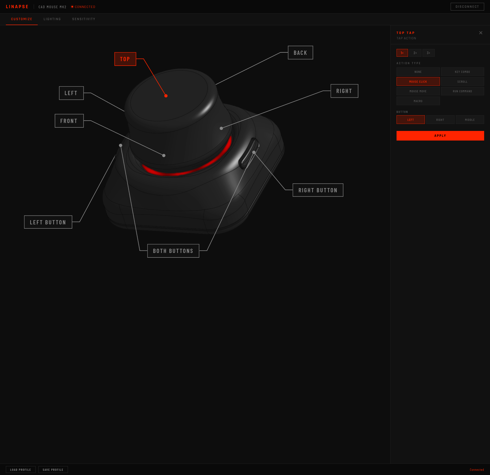
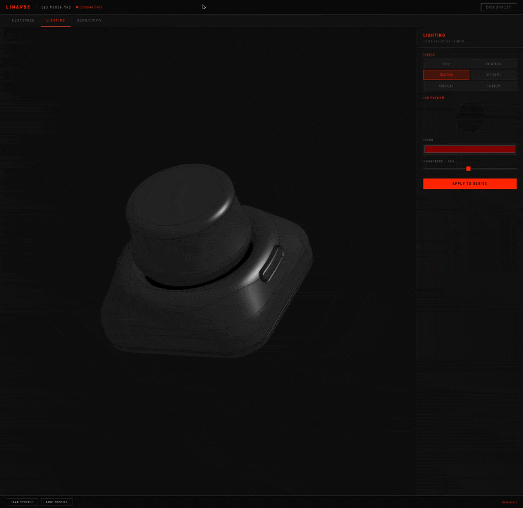
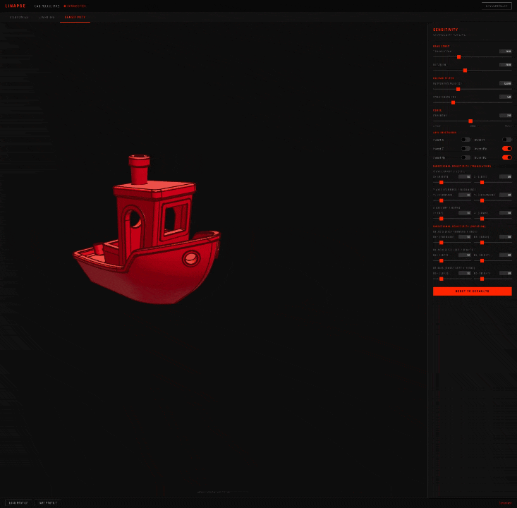

<p align="center">
  
</p>

# Linapse — CAD Mouse MK2 (v2)

<!-- DISTRO_BADGES_START -->
[](#) [](#) [](#) [](#) [](#)
<!-- DISTRO_BADGES_END -->
[](https://github.com/spikeon/linapse-cad-mouse-v2/releases/latest/download/LinapseServiceSetup.exe)
[](https://github.com/spikeon/linapse-cad-mouse-v2/releases/latest/download/linapse-service.pkg)


**Linapse** is a cross-platform software stack (supporting Linux, Windows, and macOS) for the [CAD Mouse MK2](https://github.com/sb-ocr/cad-mouse-mk2) — a DIY 6-degrees-of-freedom "space mouse" that senses motion with three magnetic field sensors instead of optics. Since the hardware has no official drivers from 3Dconnexion, this project supplies everything needed to make it a first-class input device on Linux, Windows, and macOS: device firmware, a host-side service, and an Electron configurator.

> This is an independent software fork focused on cross-platform support and the Linapse configurator. It is **not** intended to be merged back upstream. Hardware design, enclosure, PCB, and BOM live in the [original project](https://github.com/sb-ocr/cad-mouse-mk2).

---

## Features

- **Profiles & Configurable Modes** (Default, Browser, Media, and custom modes)
- Tap Gestures
- On-The-Fly Configuration Changes
- Web GUI
- Macros
- 6DoF Motion Sensing
- Wayland-Native Input Injection (Linux) & OS-Native Input Injection (Windows/macOS)
- Dynamic Tap Counts
- Live 3D Viewport Tuning
- Addressable RGB LED Control
- Native App Integrations (Linux, Windows, macOS)
- Web CAD Connector
- Multi-OS & Multi-Distro Support

## What it does

- **6DoF motion in OnShape, SketchUp Web, and Native apps.** Motion coordinates are decoded in firmware and sent via USB serial to `linapse-service`. On Linux, the service processes the motion and exposes it through a user-space UNIX socket, eliminating the need for system-wide `spacenavd`, allowing native apps (Blender, FreeCAD, OrcaSlicer, etc.) to connect directly. On Windows and macOS, the service translates 6DoF motion and injects it as standard OS mouse/keyboard inputs via the `pynput` library. On all platforms, a WebSocket bridge plus a Tampermonkey userscript carry motion into browser apps (OnShape, SketchUp Web).
- **Physical buttons, taps, and gestures.** The host service maps physical button clicks (including single click, double click, and multi-click actions), button chords, and cap-tap gestures to keystrokes, mouse events, custom shell commands, macros, or profile/mode switches.
- **Configurable modes & input suppression.** In specialized modes like **Browser** and **Media**, standard 6DoF translation/rotation reports are suppressed. Browser Mode maps the puck's pitch rotation to web page scrolling and physical buttons to browser tab navigation. Media Mode maps puck pitch to system volume control, puck twist to scrubbing, and buttons to track navigation.
- **Addressable RGB lighting.** SK6812 LEDs with multiple effects (solid, breathing, motion-reactive, swirls) configured live per-mode.
- **Linapse Electron configurator.** An Electron UI to manage modes, remap buttons/taps, design lighting, and tune the motion filter — with a live 3D Benchy viewport you can push around with the puck to feel sensitivity changes in real time.

## The configurator

An Electron app with three tabs, talking to `linapse-service` over WebSocket and writing changes to the device live. Full walkthrough: **[docs/USAGE.md](docs/USAGE.md)**.

### Active Mode Selector


Create, rename, delete, and switch between lighting and button layout profiles/modes directly from the active mode selector header.

### Customize Tab


Remap the 2 buttons (supporting multi-click tabs), the chord, and 5 cap-tap zones to keys, clicks, scrolls, commands, modes, or macros.

### Lighting Tab


Drive the SK6812 ring — solid, breathing, motion-reactive, swirl, gradient, rainbow — with live color and brightness.

### Sensitivity Tab


Tune dead zones, the Kalman filter, and the response curve against a live 3D Benchy you push with the puck.

## Architecture

```
┌──────────────────────────────────────────────────────────────────┐
│  CAD Mouse MK2  (Seeed XIAO RP2040 + 3× TLx493D magnetic sensors)  │
│  firmware/                                                         │
│   • 6DoF motion decode + Kalman filter + sensitivity curve         │
│   • tap detection, LED effect engine                               │
│   • USB HID (buttons)  +  USB serial (telemetry/config)            │
└───────────────┬───────────────────────────────┬──────────────────┘
                │ USB HID (buttons)             │ USB serial (telemetry, config)
                ▼                               ▼
        /dev/input/hidraw               linapse-service  (service/)
                │                        • reads serial & button hidraw
                │                        • dispatches buttons/taps → ydotool
                │                        • scales/inverts & writes motion
                └──────────────────────► • creates /run/user/<uid>/spnav.sock
                                         • ws://localhost:13000
                                                │                  ▲
                ┌───────────────────────────────┤                  │ WebSocket
                ▼                               ▼                  ▼
        Native Linux Apps               spacenav-ws       Linapse configurator
        (Blender, FreeCAD, etc.)        (ws :8181)        • profile/lighting/sens
        (reads spnav.sock)                      │         • live 3D Benchy viewport
                                                ▼
                                        Web Apps (OnShape, SketchUp)
                                        (Tampermonkey userscript)
```

How the data flows:
- **Motion** is decoded on the device, sent as raw 6DoF telemetry over **USB serial** to `linapse-service`. The service scales and inverts the coordinates according to user configuration. On Linux, it writes them to the user-space UNIX socket at `/run/user/<uid>/spnav.sock` where native applications read them directly. On Windows/macOS, it emulates mouse inputs directly using `pynput`.
- **Buttons** are sent as HID report events over the USB HID interface (read via `hidraw` on Linux) or over the USB serial interface (on Windows/macOS), and mapped to keystrokes/macros using `ydotool` (Linux) or `pynput` (Windows/macOS).
- **Taps and Gestures** are detected in firmware, sent over **USB serial** to `linapse-service`, and dispatched via `ydotool` (Linux) or `pynput` (Windows/macOS).
- **Configuration** (sensitivity, deadzones, lighting patterns) flows bidirectionally over **USB serial** between `linapse-service` and the device, controlled via the WebSocket connection (`ws://localhost:13000`) from the Linapse Electron configurator.

> **Note on Windows/macOS Architecture**: On Windows and macOS, UNIX sockets and udev/hidraw are not used. Button presses and motion telemetry are read entirely over the USB serial interface. Keyboard and mouse events are injected directly into the host OS using the cross-platform `pynput` library.

## Repository layout

| Path | What it is |
|------|------------|
| [`setup.sh`](setup.sh) | Top-level installer — packages, firmware (`--flash`), host integration, and configurator service. |
| [`firmware/`](firmware/) | RP2040 firmware (PlatformIO). Motion decode, filtering, tap detection, LED engine, USB HID + serial protocol. See [firmware/README.md](firmware/README.md) and [firmware/LED_COLOR_CONFIG.md](firmware/LED_COLOR_CONFIG.md). |
| [`service/`](service/) | Cross-platform host-side daemon and integration: `install.sh` (Linux), `linapse-service` (core service running on Linux, Windows, macOS), udev rules/systemd (Linux), userscripts, calibration tools. See [service/README.md](service/README.md). |
| [`docs/INTEGRATIONS.md`](docs/INTEGRATIONS.md) | Application integrations guide — how to setup, configure and verify all 14 supported and unsupported applications. |
| [`docs/LIGHTING.md`](docs/LIGHTING.md) | LED lighting guide — detailed breakdown of the 7 available lighting effects (solid, breathing, reactive, dot swirl, gradient, rainbow, volume) with animated GIF demonstrations. |
| [`docs/WINDOWS.md`](docs/WINDOWS.md) | Windows quick start & install guide — detailed setup instructions, including the pre-compiled installer, running from source, userscripts, and configuration differences. |
| [`docs/MACOS.md`](docs/MACOS.md) | macOS quick start & install guide — detailed setup instructions, including the pre-compiled package, system permissions, running from source, and configuration differences. |
| [`configurator/`](configurator/) | Linapse Electron configurator — an Electron app (Three.js 3D viewport) that talks to `linapse-service` over WebSocket. |
| [`platformio.ini`](platformio.ini) | Firmware build configuration. |

## Quick start

### One-step setup (Linux)

The top-level [`setup.sh`](setup.sh) orchestrates the whole Linux stack: it installs the distro packages (`ydotool`, `uv`), disables and uninstalls `spacenavd` (since `linapse-service` replaces it), runs the host integration, and installs a systemd user service that serves the configurator.

```bash
./setup.sh                 # packages + host integration + configurator service
./setup.sh --flash         # also build & flash the firmware first (needs PlatformIO)
./setup.sh --port 7890     # configurator port (default 7890)
./setup.sh --yes           # don't prompt before installing packages
```

### Windows & macOS installation

For Windows and macOS, we provide dedicated installation and quick start guides:
- **Windows**: **[docs/WINDOWS.md](docs/WINDOWS.md)**
- **macOS**: **[docs/MACOS.md](docs/MACOS.md)**

Pre-compiled service packages and installers are automatically generated via CI/CD pipelines:
- **Windows**: Download and run the `LinapseServiceSetup.exe` installer. It sets up `linapse-service` as a background startup daemon.
- **macOS**: Download and run the `linapse-service.pkg` installer package. It configures a `launchd` service at `/Library/LaunchAgents` to run the daemon on startup.

It still leaves two inherently hands-on steps to you: flashing the firmware (the RP2040 must be physically put into BOOTSEL mode — `--flash` walks you through it) and installing the Tampermonkey userscript (browser extensions can't be scripted). The manual breakdown below documents each piece if you'd rather run them yourself.

### 1. Flash the firmware

> [!TIP]
> You can now compile and flash the firmware directly from the **Firmware** tab in the **Linapse Configurator** UI, which automates device reboot and mounting!

To build and flash the firmware manually to the Seeed Studio XIAO RP2040:

```bash
pio run                       # build
# enter BOOTSEL: hold B, tap R on the XIAO RP2040 (or hold B while plugging in)
# copy .pio/build/seeed_xiao_rp2040/firmware.uf2 to the mounted RPI-RP2 drive
```

### 2. Install the Linux integration

```bash
cd service
chmod +x install.sh
./install.sh
```

This installs `linapse-service`, enables the systemd user services (`ydotoold`, `spacenav-ws`, `linapse-service`), writes udev rules, and patches `spacenav-ws`. Full details, prerequisites, and troubleshooting are in **[service/README.md](service/README.md)**.

Then install the Tampermonkey userscript ([`service/linapse-browser-connector.user.js`](service/linapse-browser-connector.user.js)) and open OnShape or SketchUp Web. For setup instructions for native applications (Blender, FreeCAD, Maya, etc.) and game engines (Unreal, Unity), see **[docs/INTEGRATIONS.md](docs/INTEGRATIONS.md)**.

### 3. Open the configurator

The configurator is an Electron app. Open the `configurator/` directory, install the dependencies, and start the app while `linapse-service` is running:

```bash
cd configurator
npm install
npm start
```

It connects to `linapse-service` at `ws://localhost:13000`. From there you can remap buttons and taps, design lighting, and tune the motion filter against the live 3D test viewport. See **[docs/USAGE.md](docs/USAGE.md)** for a tab-by-tab walkthrough.

## Tuning

- **Feel / gains / deadzones:** firmware defaults live in `firmware/include/Config.h` — see [firmware/README.md](firmware/README.md).
- **Live motion filter** (Kalman responsiveness/smoothness, dead zones, sensitivity curve): the configurator's Sensitivity tab, applied to the device over serial in real time.
- **Sensitivity/Inversion:** custom axis scaling, deadzones, and direction inversions are applied in `linapse-service` using user configuration (see configurator Sensitivity tab).

## Testing

To run native unit tests locally on the host machine:
- Run `pio test -e native` from the root directory.

The project also uses a cross-platform CI/CD pipeline in GitHub Actions, generating interactive test reports on every push and pull request via `dorny/test-reporter` (supporting Linux, Windows, and macOS test suites).

For design details, architecture, mocking details, and CI/CD interactive reports explanation, see **[docs/TESTING.md](docs/TESTING.md)**.

## Credits & license

Built on the open-source hardware and firmware of **[sb-ocr/cad-mouse-mk2](https://github.com/sb-ocr/cad-mouse-mk2)** by sb-ocr, incorporating the Kalman filter and sensitivity curves logic by **[lenkaiser](https://github.com/lenkaiser)** from pull request [sb-ocr/cad-mouse-mk2#3](https://github.com/sb-ocr/cad-mouse-mk2/pull/3). Hardware build guide: [Instructables](https://www.instructables.com/CAD-Mouse-MK2-a-6DoF-Space-Mouse-Using-Magnets).

Licensed under [CC BY-NC-SA 4.0][cc-by-nc-sa], matching the upstream project.

[![CC BY-NC-SA 4.0][cc-by-nc-sa-shield]][cc-by-nc-sa]

[cc-by-nc-sa]: http://creativecommons.org/licenses/by-nc-sa/4.0/
[cc-by-nc-sa-shield]: https://img.shields.io/badge/License-CC%20BY--NC--SA%204.0-lightgrey.svg
