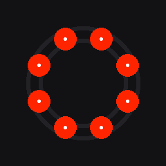
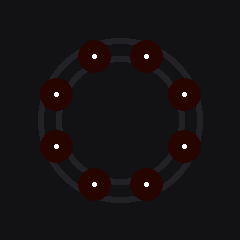
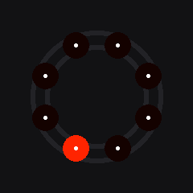
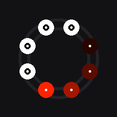
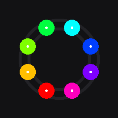

# Linapse CAD Mouse — LED Lighting Guide

This guide describes how the SK6812 addressable RGB LED ring works on the **CAD Mouse MK2**, documents the 7 available lighting effects, and explains how to configure them.

---

## How It Works

The CAD Mouse MK2 enclosure houses an 8-LED ring positioned around the base channel.
- **Firmware Effect Engine**: The Seeed Studio XIAO RP2040 runs a dedicated, non-blocking FSM thread (`EffectEngine.cpp`) that updates the LED colors at a high frame rate.
- **Gamma Correction**: Human eyes perceive brightness logarithmically, and different color LEDs have different efficiencies. The firmware automatically decodes color values using sRGB gamma correction (gamma 1.8 for red, 2.2 for green and blue) to ensure colors look accurate and vibrant at any brightness level.
- **Persistence**: Your lighting settings (brightness, color, active effect) are saved per-mode (profile) and written to the RP2040's emulated EEPROM flash storage, persisting across reboots and device unplugging.

---

## Supported Effects

### 1. Solid
Displays a single, constant, static color across all 8 LEDs.
- **Configurability**: Takes any custom `#RRGGBB` color and brightness.



---

### 2. Breathing
Fades all 8 LEDs in and out smoothly using a sine wave, creating a pulsing glow.
- **Configurability**: Fades between 20% and 100% of the configured color and max brightness.



---

### 3. Reactive
Lights respond dynamically to physical motion of the mouse puck.
- **Behavior**: The ring stays dimmed (or off) when the mouse is at rest. Moving the puck causes the LEDs to instantly brighten to 100%. When motion stops, they fade slowly back to idle.
- **Configurability**: Takes custom color and max brightness. Idle dimness and rise/fall rates are configured via compile-time parameters in `Config.h`.


---

### 4. Dot Swirl
A single, fully-lit LED orbits the ring clockwise at a constant speed of 1 revolution per second.
- **Configurability**: Takes custom color and max brightness.



---

### 5. Gradient Swirl
A comet-like orbit effect. A bright leading "head" sweeps clockwise around the ring, followed by a fading quadratic trail of 4 LEDs.
- **Configurability**: Takes custom color and max brightness.



---

### 6. Rainbow Swirl
A full spectrum rainbow rotating around the ring clockwise, creating a dynamic color-wheel effect.
- **Configurability**: Ignores the configured color setting but respects the max brightness slider.



---

### 7. Volume
Displays the host operating system's current playback volume (0% to 100%) on LEDs 1 to 8.
- **LED Layout**:
  - `0% Volume`: All LEDs off.
  - `50% Volume`: LEDs 1 to 4 fully lit.
  - `100% Volume`: All 8 LEDs fully lit.
  - **Highest Active LED**: Automatically dims or brightens proportionally to represent fractional volume between 12.5% increments (e.g. at 56.25% volume, LEDs 1-4 are 100% bright, and LED 5 is 50% bright).
- **Physical Layout Reference**:
  ```
       [Top]
       4   5
     3       6
     2       7
     1       8
     [Bottom/Front]
  ```
  LEDs light up starting from LED 1 (bottom-left) around clockwise to LED 8 (bottom-right).
- **Host Syncing**: `linapse-service` queries the master audio volume level on the host system (every 250ms) and pushes updates to the device over the USB Serial interface (command: `volume <0-100>\n`).
- **Configurability**: Takes custom color and max brightness.


---

## Configuring Lighting

There are two ways to configure the lighting effects:

### Method 1: Web Configurator (Recommended)
1. Serve and open the web configurator (`http://localhost:7890`).
2. Go to the **Lighting** tab.
3. Select an **Effect**, choose a **Color** using the color-picker, adjust the **Brightness** slider, and click **Apply to Device**.
4. The configurations are saved to the current active profile (mode).

### Method 2: Command Line (Serial)
If you are connected via serial or writing script triggers, you can send raw text commands to change settings on-the-fly:
- `led effect <solid|breathing|reactive|dot_swirl|gradient_swirl|rainbow_swirl|volume>`
- `led color <RRGGBB>` (e.g. `led color FF00FF`)
- `led brightness <0-255>` (e.g. `led brightness 128`)
- `led show` (dumps active lighting values)
