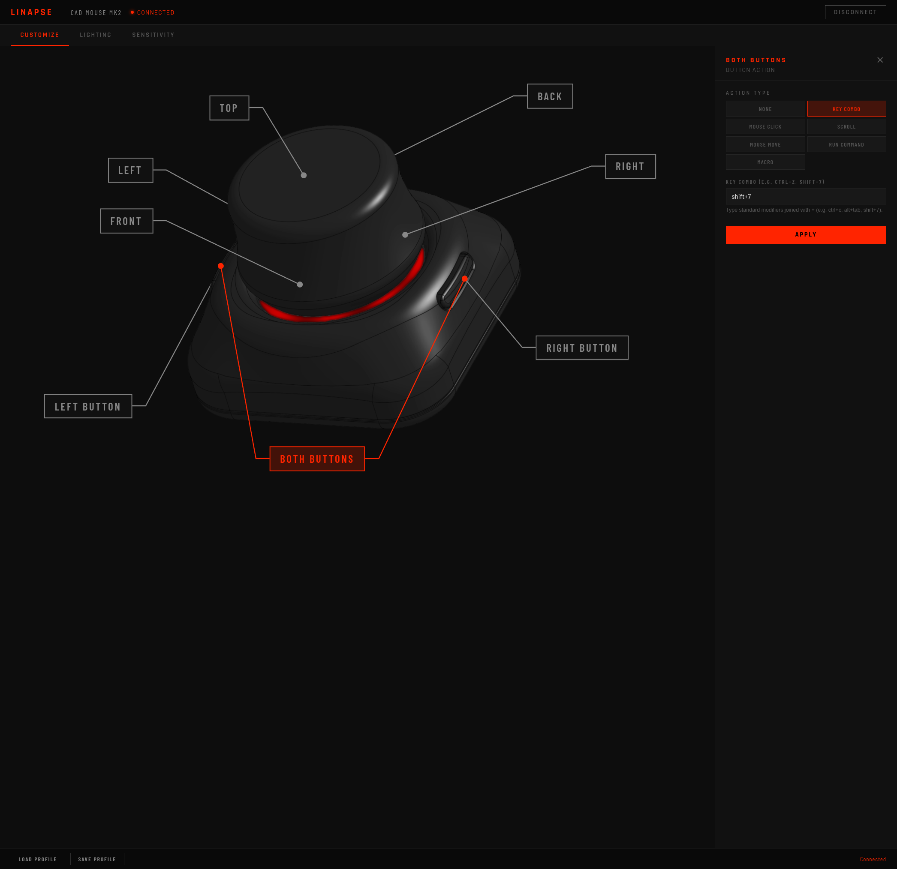
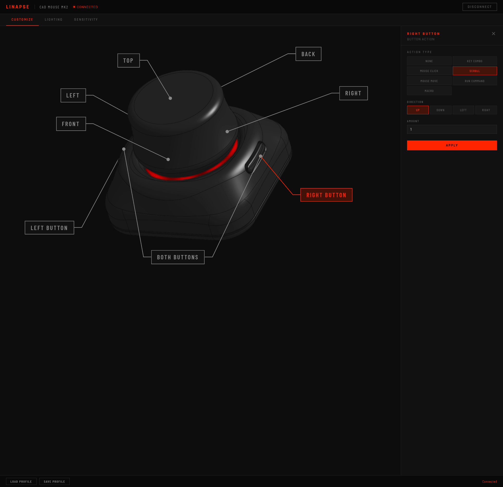
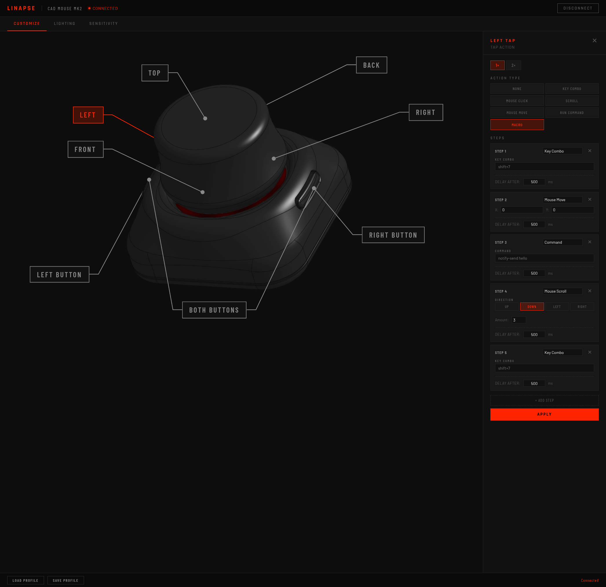

# Using the Linapse Configurator

The Linapse configurator is an Electron-based control panel for the CAD Mouse MK2. It talks to `linapse-service` over a WebSocket (`ws://localhost:13000`) and lets you remap buttons and taps, design RGB lighting, and tune the motion filter — all applied to the device live over the serial link.

This guide walks through each tab. For install/setup, see the [main README](../README.md) and [service/README.md](../service/README.md). For configuring specific 3D/CAD applications, see the **[Application Integrations Guide](INTEGRATIONS.md)**.

## Before you start

1. Plug in the device and confirm `linapse-service` is running (`systemctl --user status linapse-service`).
2. Open the configurator directory, install dependencies, and start the app:
   ```bash
   cd configurator
   npm install
   npm start
   ```
3. The header shows the connection state. **CONNECTED** (red dot, top-left) means the configurator is talking to the device. If it reads **Disconnected**, start `linapse-service` and reload.

The three tabs — **Customize**, **Lighting**, **Sensitivity** — run across the top. **Load Profile** / **Save Profile** in the footer persist the full device config (all three tabs) to a JSON file.

---

## Modes — profiles & overrides


The configurator supports a **Modes** system, letting you define multiple distinct button layouts and LED configurations for different applications or states. 

- **Mode Selector**: Create, rename, delete, and switch between modes using the dropdown controls in the header. Changing buttons or lighting settings automatically updates the currently selected active mode.
- **Active Mode**: The selected mode is immediately applied to the device. You can configure buttons or tap gestures to switch modes on-the-fly.

### Pre-Configured Overrides
Linapse includes two specialized modes that suppress standard 6DoF motion reports:
- **Browser Mode**: Puck pitch (`rx` axis) scrolls web pages, and the physical buttons navigate between browser tabs (`ctrl+pageup`/`ctrl+pagedown`).
- **Media Mode**: Puck pitch (`rx` axis) controls system volume (inverted: push forward for volume up, pull back for volume down), twist (`rz` axis) scrubs forward/back, and physical buttons trigger previous/next track.

---

## Customize — buttons & taps


The 3D device is annotated with every input zone. Click a callout to open its action panel on the right.

### Multi-Click Button Configurations
For the physical **Left Button** and **Right Button**, you can configure different actions for single click (`1×`), double click (`2×`), or triple click (`+`) events. Click on the corresponding click tab inside the callout panel to customize these. Standard scrolling remains zero-latency.

### Action Configuration Screens

- **Key Combo Configuration**:
  
- **Scroll Configuration**:
  
- **Tap & Mouse Configuration**:
  
- **Macro Configuration**:
  

**Input zones (8):**

| Zone | What triggers it |
|------|------------------|
| **Left Button** / **Right Button** | The two physical buttons (supports multi-click tabs). |
| **Both Buttons** | Chord — press both buttons together. |
| **Top Tap** | Tap the top of the cap. |
| **Front / Back / Left / Right Tap** | Tap a side of the cap (gesture detected in firmware). |

**Action types** — assign any of these to a zone:

| Action | Effect |
|--------|--------|
| **None** | Disable the zone. |
| **Key Combo** | Send a keystroke or shortcut (e.g. `Esc`, `Ctrl+Z`). |
| **Mouse Click** | Left / middle / right click. |
| **Scroll** | Scroll by an amount/direction. |
| **Mouse Move** | Move the cursor. |
| **Run Command** | Execute a shell command on the host. |
| **Scroll Up** / **Scroll Down** | One-shot scroll step. |
| **Mode** | Switch active button/LED profile mode. |
| **Media** | Send media control keys (*Play, Pause, Forward, Back, Fast Forward, Rewind, Mute, Volume Up, Volume Down*). |
| **Macro** | A sequence of steps with per-step delays. |

Pick the action type, fill in its parameters, then hit **Apply** to write the mapping to the device.

> Tap zones rely on firmware tap detection. If taps misfire or don't register, recalibrate with the tools in [`service/`](../service/) — see [service/README.md](../service/README.md).

---

## Lighting — RGB effects


Controls the SK6812 LED ring. Pick an **Effect**, watch the **LED Preview** ring update, then **Apply to Device**.

**Effects (6):**

| Effect | Behavior |
|--------|----------|
| **Solid** | Single static color. |
| **Breathing** | Color fades in and out. |
| **Reactive** | Lights respond to device motion. |
| **Dot Swirl** | A dot chases around the ring. |
| **Gradient** | Color gradient across the ring. |
| **Rainbow** | Full-spectrum cycle (shown above). |

- **Color** — picker for effects that use a base color (Solid, Breathing, Dot Swirl, Gradient).
- **Brightness** — `0–255`. Lower it if the ring is too bright.

The **LED Preview** ring is a live mock of what the device will show before you apply.

> Per-LED color math and the effect engine are documented in [firmware/LED_COLOR_CONFIG.md](../firmware/LED_COLOR_CONFIG.md).

---

## Sensitivity — motion tuning


Tune the 6DoF motion filter against a live 3D **Benchy** test model. **Changes apply live** — drag the puck and feel the difference immediately. The viewport prompt reads **MOVE PUCK TO TEST**.

The Sensitivity panel is organized into three sub-tabs:

### General
Configure filter settings and dead zones:
- **Dead Zones**: Ignore tiny unintended motion. Translation range `0 – 50` (default `16`), Rotation range `0 – 50` (default `20`).
- **Kalman Filter**: Trade responsiveness against smoothness. Responsiveness (Q) range `0.05 – 2` (default `0.5`, higher = snappier), Smoothness (R) range `0.5 – 15` (default `4`, higher = smoother).
- **Curve (Exponent)**: Input-to-output response shaping from `1 – 5` (default `3`). Low values give linear 1:1 response, high values make small movements gentle and large movements aggressive.
- **Lock Translation during Rotation**: When enabled (default), translation is suppressed while the user is actively rotating the puck. Toggle off to allow simultaneous translation and rotation.

### Axes (Directional Sensitivity & Calibration Wizard)


Manage sensitivity individually for all 12 direction vectors:
- **Max Sensitivity**: Sliders and inputs accept values up to `20.0` (previously `5.0`) to accommodate pucks with tighter spring deflection or user preferences.
- **Interactive Calibration Wizard**: Click **Run Calibration Wizard** at the top of the Axes tab to start a guided, step-by-step setup:

  

  1. The wizard overlays on top of the Benchy canvas.
  2. For each of the 6 physical axes (X, Y, Z, Rx, Ry, Rz), you will deflect the puck to your comfortable limits for 3 seconds.
  3. Telemetry is measured unscaled (using a temporary `1.0` sensitivity baseline).
  4. The wizard computes optimal sensitivity coefficients `S = 350.0 / peak` clamped to `[0.1, 20.0]` (rounded to 1 decimal place).
  5. The new directional sensitivities are applied to your sliders and saved automatically.

### Tap
Configure touch and tap parameters:
- **Velocity Threshold**: Speed at which a tap is registered.
- **Invert Tap Z Axis**: Toggle to invert tap direction if downward taps do not register (useful if puck magnets are reversed).

**Reset to Defaults** restores every slider on this tab.

> These values map to the firmware defaults in `firmware/include/Config.h`. The configurator pushes them over serial at runtime; to change the boot defaults, edit `Config.h` and reflash — see [firmware/README.md](../firmware/README.md).

---

## Profiles

The footer's **Save Profile** / **Load Profile** export and import the complete configuration — button/tap maps, lighting, and sensitivity — as a single JSON file. Save a profile per workflow (e.g. one for OnShape, one for FreeCAD) and load on demand.

---

## Firmware — flashing


The **Firmware** tab lets you compile and flash the CAD Mouse MK2 firmware directly from the configurator.

- **Firmware Compilation**: Uses PlatformIO to compile the source code in the repository.
- **Auto-BOOTSEL Reset**: Automatically detects connected devices and puts them into BOOTSEL mode over the serial link (using a 1200 baud reset).
- **Fresh Board Flashing**: If a board has never been flashed before (or is in bootloader mode already), the configurator will automatically search for the `RPI-RP2` block drive, mount it (using `udisksctl` on Linux), copy `firmware.uf2`, and reboot it.
- **Flashing Console**: A cyberpunk-themed console logs progress in real time, from locating repo roots and invoking PlatformIO to mounting and writing files.
